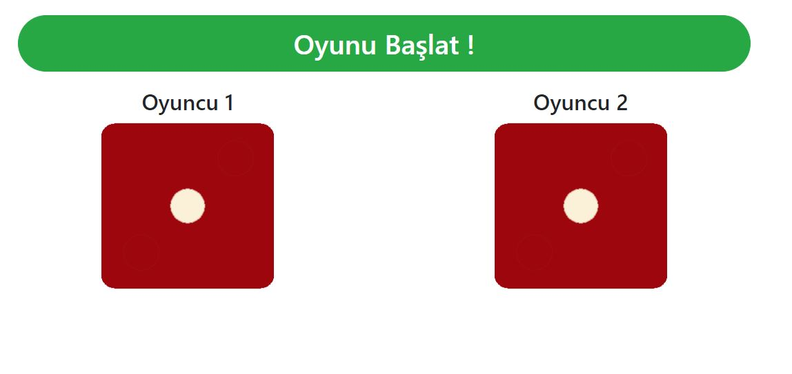
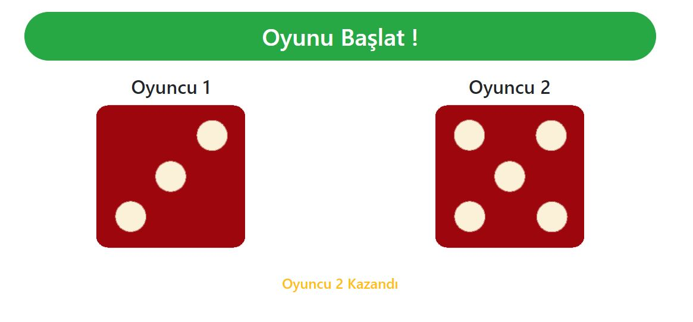

# DiceGame

### HomePage


### Player 2 Win



## Installation

```
$ git clone https://github.com/SedatBasaran14/DiceGame.git
$ cd DiceGame
$ Npm install
```

## DOM
I made a simple dice game on 'Document Object Model'. I used Bootstrap in the design of the game. I used JavaScript to run it.
